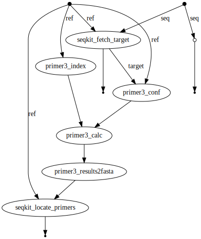

# primer3_nf
A Nextflow wrapper for Primer3

Primer3, is a little finicky to setup. This wraps the software installation & preparation. Currently, it is meant to produce PCR/Sanger sequencing primers around a target site for TIDE mutation detection, but presumably could be adapted to other uses cases without much trouble.

Dependencies:
* Miniconda , (can be installed by a user, see https://docs.conda.io/en/latest/miniconda.html)
* Nextflow , (once you have conda installed: `conda install -y nextflow`)

### Running the pipeline
```
nextflow run -resume primer3.nf --genome examples/example.fa --targetseq ATGGGAGGAGAAGGGTATCGCGG
```

### Results
 Look in `./results` once the pipeline is complete

### Primer3 citations
https://primer3.org

Untergasser A, Cutcutache I, Koressaar T, Ye J, Faircloth BC, Remm M and Rozen SG.
Primer3--new capabilities and interfaces.
Nucleic Acids Res. 2012 Aug 1;40(15):e115.
http://www.ncbi.nlm.nih.gov/pmc/articles/PMC3424584/

Koressaar T and Remm M.
Enhancements and modifications of primer design program Primer3.
Bioinformatics 2007;23(10):1289-1291.
https://www.ncbi.nlm.nih.gov/pubmed/17379693

Koressaar T, Lepamets M, Kaplinski L, Raime K, Andreson R and Remm M.
Primer3_masker: integrating masking of template sequence with primer design software.
Bioinformatics 2018;34(11):1937-1938.
https://www.ncbi.nlm.nih.gov/pubmed/29360956

### Directed acyclic graph of pipeline execution
(Note, DAG rendering is a little broken currently)



